# Procesverslag
Markdown is een simpele manier om HTML te schrijven.  
Markdown cheat cheet: [Hulp bij het schrijven van Markdown](https://github.com/adam-p/markdown-here/wiki/Markdown-Cheatsheet).

Nb. De standaardstructuur en de spartaanse opmaak van de README.md zijn helemaal prima. Het gaat om de inhoud van je procesverslag. Besteedt de tijd voor pracht en praal aan je website.

Nb. Door *open* toe te voegen aan een *details* element kun je deze standaard open zetten. Fijn om dat steeds voor de relevante stuk(ken) te doen.

## Jij

  
uitwerken voor kick-off werkgroep

  ### Auteur:
  Koen Janssen

  #### Je startniveau:
  Rood

  #### Je focus:
  Responsive (kies uit responsive óf surface plane)
  

## Je website

  
uitwerken voor kick-off werkgroep

  ### Je opdracht:
  https://www.microsoft.com/nl-nl/

  #### Screenshot(s) van de eerste pagina (small screen): 
  Homepage
  

  #### Screenshot(s) van de tweede pagina (small screen):
  Windows
  
 

## Toegankelijkheidstest 1/2 (week 1)

  
uitwerken na test in 2e werkgroep

  Uit de test kwam dat Microsoft best wel goed toegankelijk is gemaakt en er over veel is nagedacht maar in de code zitten een paar dingen die eigenlijk niet mogen zoals errors en div's voor alles
  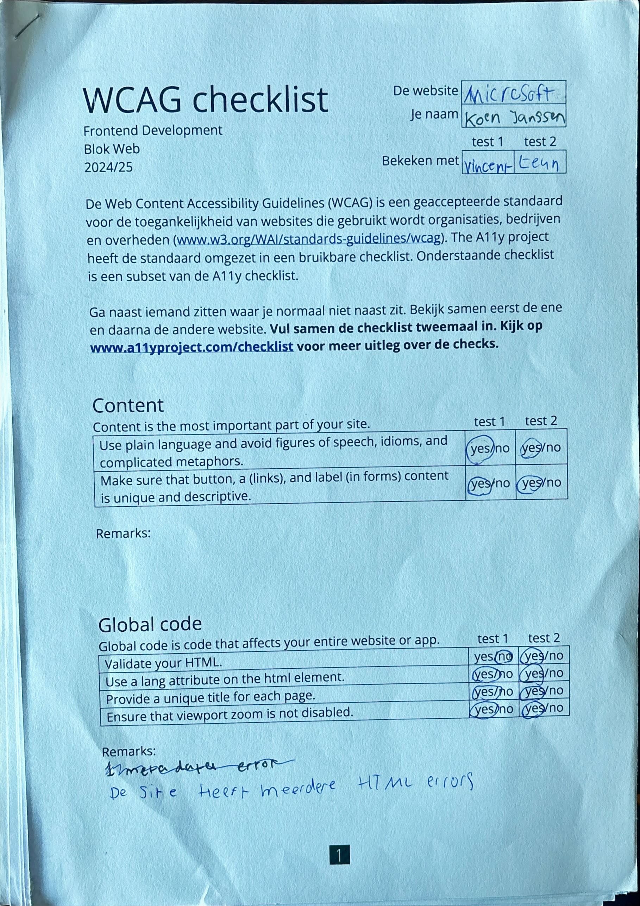
  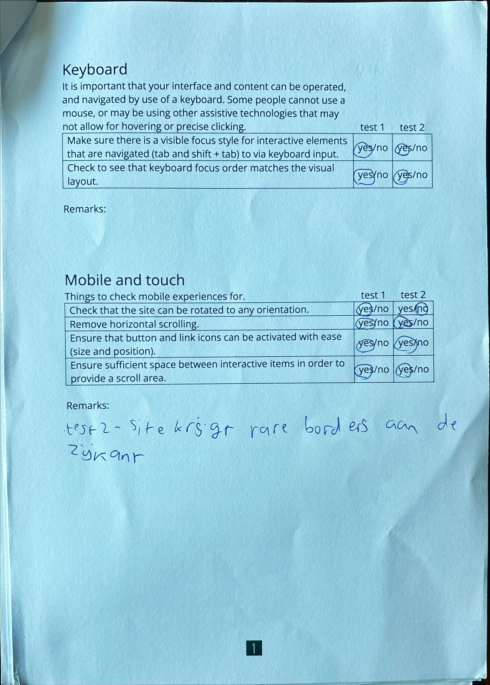
  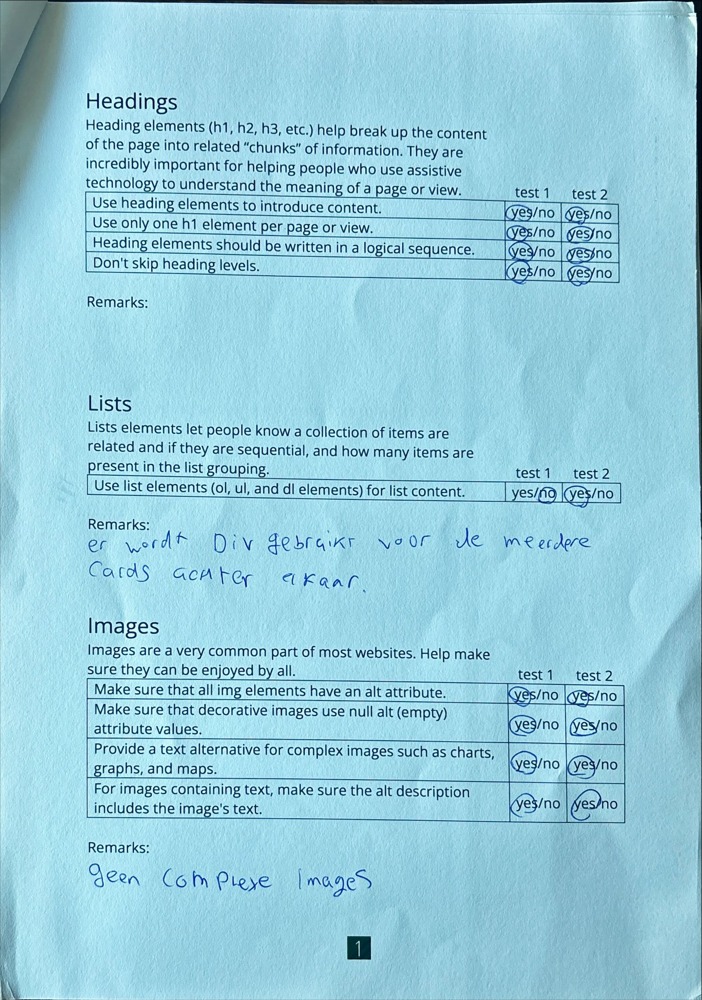
  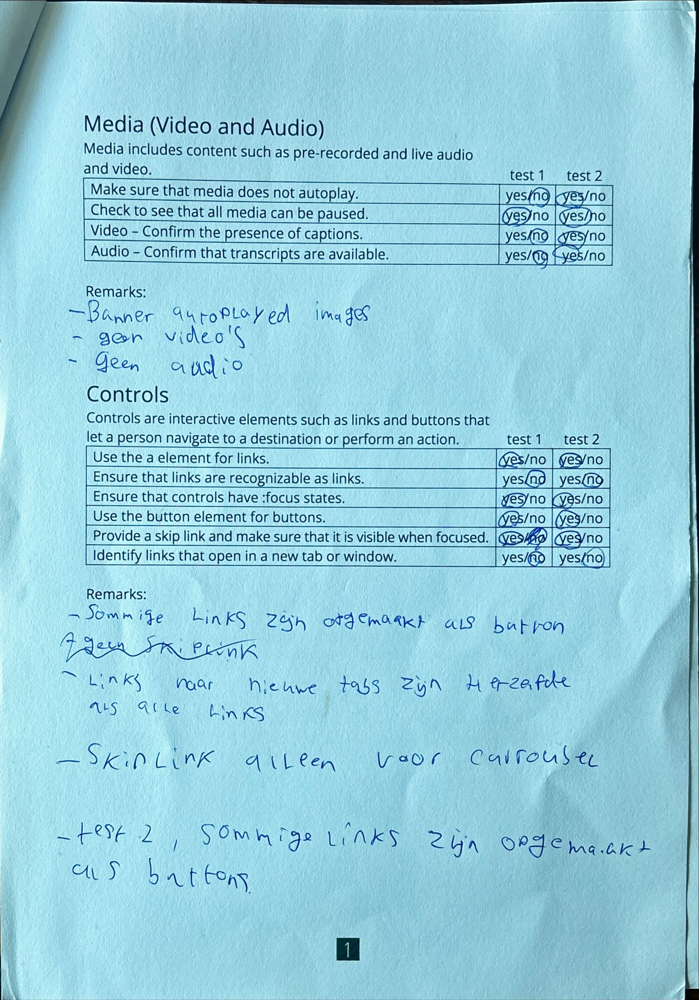
  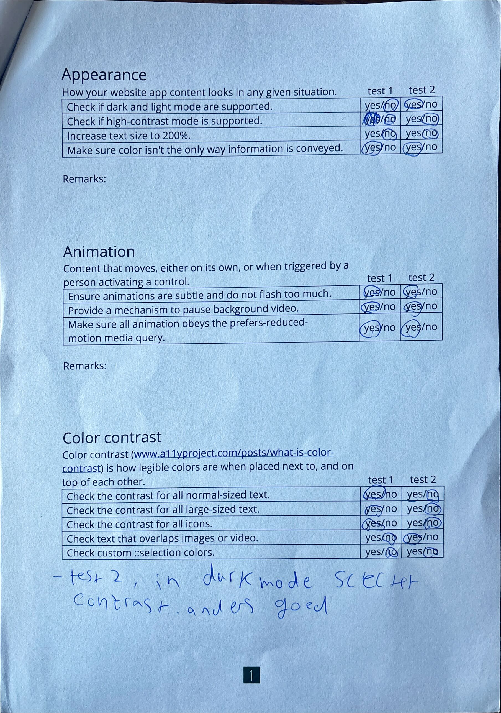
  (ik heb de foto's later pas toegevoegd vandaar dat test 2 er ook al in staat)

  ### Bevindingen
  Lijst met je bevindingen die in de test naar voren kwamen:
 - De site heeft meerdere HTML errors
 -Er worden div's gebruikt woord UL zouden moeten zijn
 -De website heeft geen complexe images
 -Banner autoplayed images
 -Geen video's
 -Geen audio
 -Sommige links zijn opgemaakt als button
 -links naar nieuwe tabs zijn hetzelfde opgemaakt als normale links

## Breakdownschets (week 1)

  
uitwerken na afloop 3e werkgroep

  Ik heb geprobeerd in te schatten waar bepaalde elementen moeten. Ik ben niet heel zeker ervan of dit klopt want ik moet nog beginnen aan oprechte code schrijven.

  ### de hele pagina: 
  

  ### dynamisch deel (bijv menu): 
  

## Voortgang 1 (week 2)

  
uitwerken voor 1e voortgang

  ### Stand van zaken
  hier dit ging goed & dit was lastig (neem ook screenshots op van delen van je website en code)

  In deze week heb ik eigenlijk alleen mijn header en nav gedeeltelijk gemaakt, dit bleek heel lastig te zijn door hoe responsive de header van microsoft is. Ik heb de code uit de hamburger menu opdracht gebruikt en deze aangepast. Een paar dingen werken nog niet zoals dat mijn a tags niet de volledige breedte willen innemen en een paar dingen zijn raar gespaced.

  ### Agenda voor meeting
  samen met je groepje opstellen

  | student 1      | student 2          | student 3    | student 4        |
  | Lisa           | koen               | ---          | ---              |
  | dit bespreken  | en dit             | en ik dit    | en dan ik dat    |
  | en dat ook nog | dit als er tijd is | nog een punt | dit wil ik zeker |
  | ...            | ...                | ...          | ...              |
-Lisa
Bespreken: Mijn HTML, mijn navigatie en header welke soort foto ik moet gebruiken voor logo.

-Koen
Bespreken: Mijn HTML, mijn navigatie en structuur van CSS

van de rest heb ik niks te horen gekregen

  ### Verslag van meeting
  hier na afloop snel de uitkomsten van de meeting vastleggen

  - punt 1 Ik heb gevraagd hoe ik mijn a tags de volledige breedte van de parent kon geven in het hamburgermenu en dit moest door display block en padding
  - punt 2 verder heb ik niks kunnen vragen naast het fixen van mijn github
  

## Voortgang 2 (week 3)

  
uitwerken voor 2e voortgang

  ### Stand van zaken
  hier dit ging goed & dit was lastig (neem ook screenshots op van delen van je website en code)
  
  Het maken van het hamburger menu is goed gelukt en ik heb mijn banner cards helemaal werkend gekregen inclusief de carrousel functie met javascript. Ik loop nu een beetje tegen de rest van de cards aan omdat ik dit met grid wou doen.

  ### Agenda voor meeting
  samen met je groepje opstellen

  | student 1      | student 2          | student 3    | student 4        |
  | ---            | ---                | ---          | ---              |
  | dit bespreken  | en dit             | en ik dit    | en dan ik dat    |
  | en dat ook nog | dit als er tijd is | nog een punt | dit wil ik zeker |
  | ...            | ...                | ...          | ...              |
  Vragen over de grid cards en over hoe ik mijn footer goed krijg en html checken

  ### Verslag van meeting
  hier na afloop snel de uitkomsten van de meeting vastleggen

  - punt 1 De cards mogen met een divje en ik hoef geen grid te gebruiken
  - punt 2 het footer probleem is opgelost nadat er verteld was dat a elementen inline zijn en dus automatisch naast elkaar gaan staan.
  - nog een punt voeg een h2 toe bij elke section en maak deze onzichtbaar als het moet maar voor screenreaders is het nodig.

## Toegankelijkheidstest 2/2 (week 4)

  
uitwerken na test in 9e werkgroep

  
  
  
  
  

  ### Bevindingen
  Lijst met je bevindingen die in de test naar voren kwamen (geef ook aan wat er verbeterd is):
  
  Uit de test blijkt eigenlijk wel de website heb verbeterd maar niet met veel. Microsoft was al heel goed en dus een moeilijke opdracht. Ik verlies op de contrast niveau doordat mijn darkmode erg slecht is door gebrek aan tijd. Ook heb ik een paar dingen niet kunnen verbeteren wat eigenlijk wel hoorde zoals dat er sommige links zijn opgemaakt als buttons. Ik heb de layout en buttons precies nagemaakt en had dus geen tijd meer om dit beter te maken. 
  (Ik heb deze test pas in week 5 afgemaakt omdat ik nog geen volledige pagina met darkmode klaar had tijdens deze week)

## Voortgang 3 (week 4)

  
uitwerken voor 3e voortgang

  ### Stand van zaken
  hier dit ging goed & dit was lastig (neem ook screenshots op van delen van je website en code)

  Ik loop op schema, ik heb de homepagina volledig af naast darkmode en ben net begonnen met de windows pagina. Ik loop nu tegen eigenlijk tegen niks aan dus ik heb ook niet echt vragen.

  ### Agenda voor meeting
  samen met je groepje opstellen

  | student 1      | student 2          | student 3    | student 4        |
  | ---            | ---                | ---          | ---              |
  | dit bespreken  | en dit             | en ik dit    | en dan ik dat    |
  | en dat ook nog | dit als er tijd is | nog een punt | dit wil ik zeker |
  | ...            | ...                | ...          | ...              |
Ik heb geen vragen behalve HTML laten checken

  ### Verslag van meeting
  hier na afloop snel de uitkomsten van de meeting vastleggen

  - punt 1 Verplaatst custom properties naar main css bestand
  - punt 2 Html is goed

## Eindgesprek (week 5)

  
uitwerken voor eindgesprek

  ### Je uitkomst - karakteristiek screenshots:

  

  ### Dit ging goed/Heb ik geleerd: 
  Korte omschrijving met plaatjes

  Ik heb ontzettend veel geleerd bij dit vak. Vooral over css, een paar dingen:
  -Overflow (carrousels)
  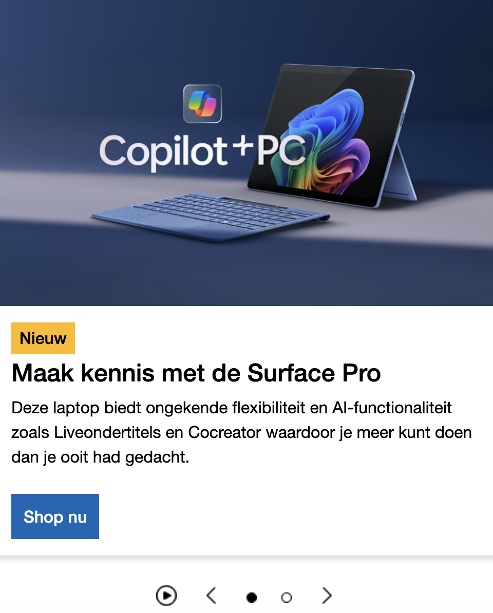
  -Grid en repeating grids
  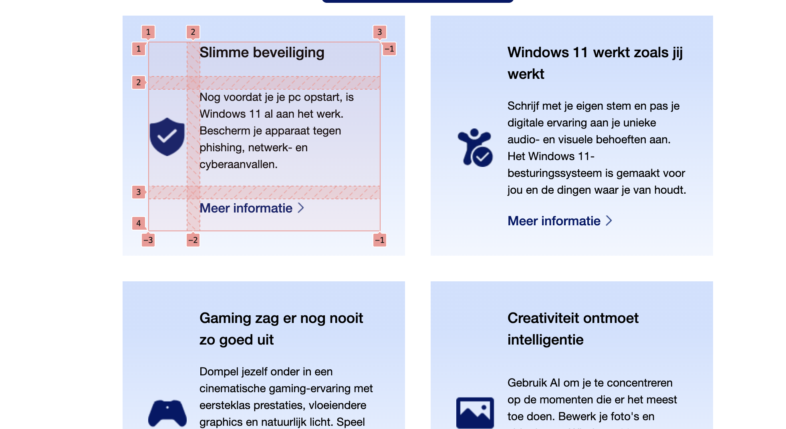
  -Flexbox volledig begrijpen
  -Positioning
    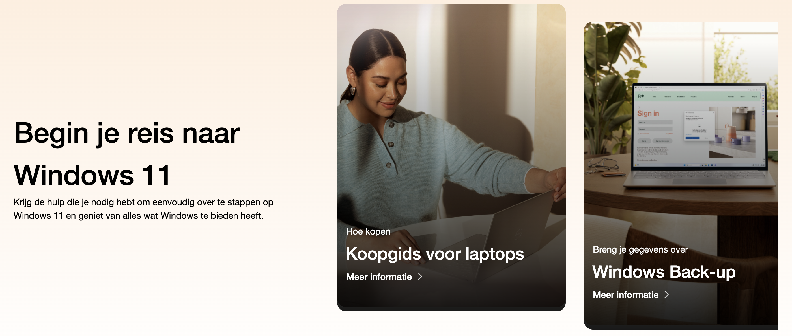
  -Semantischer HTML
  -Responsiveness
    
  -Hamburger menu's
  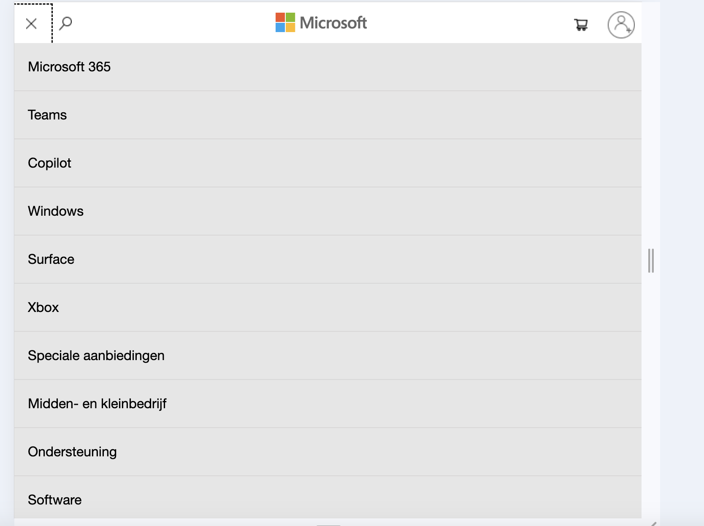
  -custom properties / darkmode
  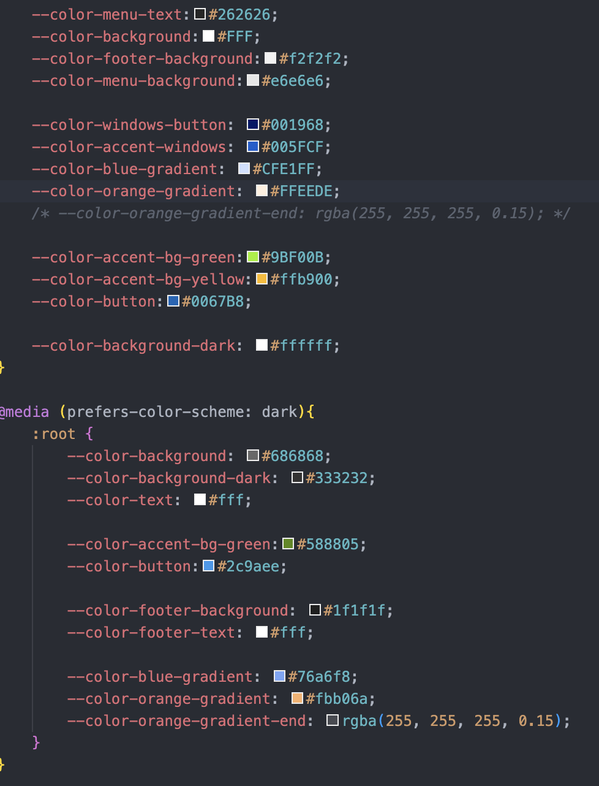

  Wat vooral goed ging en waar ik het meest trots op ben is de carrousel op de homepagina. Ook vind ik dat ik best dichtbij zit bij hoe de website van microsoft eruit ziet vooral op homepage die is bijna 1 op 1.

  ### Dit was lastig/Is niet gelukt:
  Korte omschrijving met plaatjes

  Het is mij niet gelukt om op de windows pagina de carrousels na te maken. Ik had niet genoeg tijd om het met javascript te doen dus ik wou ze namaken maar dan niet functioneel. Ook dit lukte niet omdat het niet goed responsive was met position absolute. Ik heb er daarom een overflow-x:scroll; van gemaakt bij alle carrousels.
  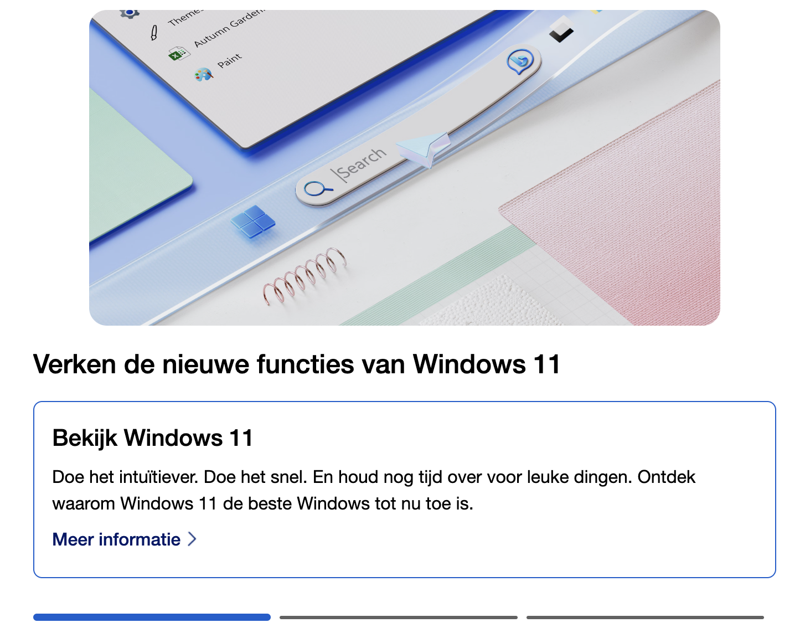

  Daarnaast is het me niet gelukt om bepaalde dingen beter te maken dan de website van microsoft. Bijvoorbeeld is de tab volgorde in mijn header raar (dit mocht ik laten van de docent) en zijn er links opgemaakt als buttons.
  

## Bronnenlijst

  
continu bijhouden terwijl je werkt

  Ik heb geen code van andere gebruikt dus ik heb geen bronnen.

  Nb. Wees specifiek ('css-tricks' als bron is bijv. niet specifiek genoeg). 
  Nb. ChatGpT en andere AI horen er ook bij.
  Nb. Vermeld de bronnen ook in je code.

  1. bron 1
  2. bron 2
  3. ...

